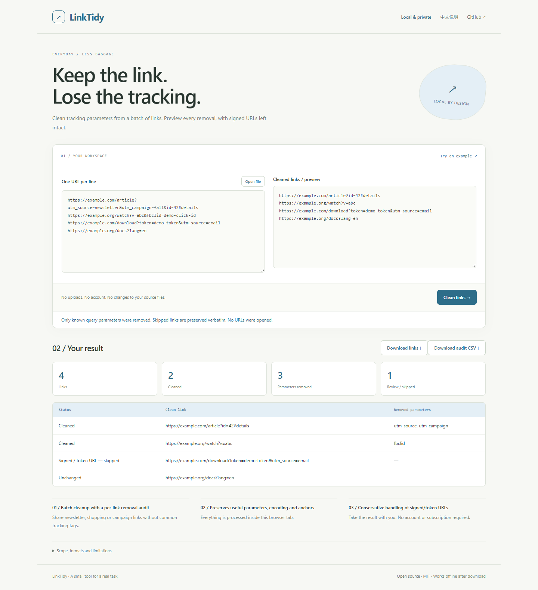

# LinkTidy

**Keep the link. Lose the tracking.**

Clean tracking parameters from a batch of links. Preview every removal, with signed URLs left intact.

[Open the app](https://sq2100.com/linktidy/) · [Download offline HTML](https://github.com/sq2100/linktidy/releases/latest) · [简体中文](README.zh-CN.md)



## Why use it?

Share newsletter, shopping or campaign links without common tracking tags.

- Batch cleanup with a per-link removal audit
- Preserves useful parameters, encoding and anchors
- Conservative handling of signed/token URLs

No uploads, account, API key, tracking scripts, or runtime CDN dependencies. The built app is a single HTML file. Source files are never modified.

## Quick start

Open the [hosted app](https://sq2100.com/linktidy/) and click **Try an example**. Or download the HTML from [Releases](https://github.com/sq2100/linktidy/releases/latest), then open it in a modern desktop browser.

To build from source (Node.js 20.19+):

```sh
npm ci
npm test
npm run build
```

Open `dist/index.html`, or run `npm start` for a local preview at http://127.0.0.1:4178. Set the `PORT` environment variable to run multiple projects simultaneously.

## Scope and limitations

Removes known query tracking keys such as utm_*, fbclid and gclid. No redirects are followed and no network checks occur. Useful parameters, ordering, original encoding and fragments are retained. Known signed/token URLs and credential-bearing URLs are skipped, but unknown signing schemes cannot be recognized. Removing a parameter can affect a service that uses it for a nontracking purpose; inspect the preview. This is not a malware or anonymity tool. Up to 10,000 links and 5 MiB text imports.

The initial version targets modern desktop browsers. Chromium is used for local smoke checks. Browser differences and real-world data may reveal additional edge cases; please report reproducible problems with synthetic examples. No guarantee of suitability for every input is made.

## Privacy

The app processes data in memory and has no application server, analytics, cookies, local storage or external runtime resources. A Content Security Policy blocks network connections and external scripts. User data is rendered as text, except for the intentionally previewed local images and validated colors.

The hosting provider receives normal page-request metadata (such as IP addresses). Download the HTML and open it offline for disconnected work. Exported files may contain your data. Browser extensions, the operating system and a modified hosted copy are outside this app's control.

## Development

Plain JavaScript, browser APIs, Node’s built-in test runner, and esbuild. Core logic lives in `src/core.js`; UI behavior is in `src/app.js`. Run `npm run format` before sending changes. GitHub Actions tests and builds each push; the separate Pages workflow publishes the demo when run manually.

[Contributing](CONTRIBUTING.md) · [Security](SECURITY.md) · [MIT license](LICENSE)
